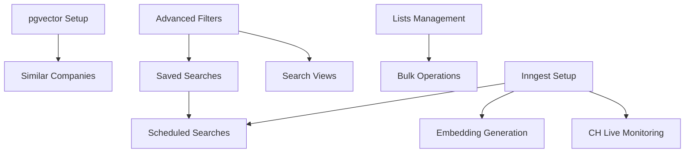

# Complete Implementation Plan: SourceScrub-Inspired Features for oppSpot

**Created**: 2025-10-04
**Status**: In Progress
**Timeline**: 6 Months (135 days)
**Team Size**: 2-3 Full-stack Developers

---

## Executive Summary

Implement 11 high-value features from SourceScrub specifications to transform oppSpot into a comprehensive B2B deal sourcing platform. This plan leverages oppSpot's existing AI capabilities while adding enterprise-grade search, filtering, and collaboration features.

### Strategic Value
- **10x faster prospecting** through advanced filters
- **AI-powered discovery** using vector similarity search
- **Complete company intelligence** with 7-tab profiles
- **Team collaboration** with shared lists and workflows
- **UK market edge** through conference tracking and Companies House monitoring

---

## PHASE 1: Search & Discovery Foundation (Months 1-2)

### Feature 1: Advanced Filter System ⭐ HIGHEST PRIORITY

**Objective**: Add sophisticated 11-category filter system inspired by SourceScrub

**Database Migration**: ✅ COMPLETED
- File: `supabase/migrations/20250202_advanced_filters.sql`
- Added 40+ filter columns to businesses table
- Created 25+ optimized indexes
- Auto-calculation triggers

**TypeScript Types**: ✅ COMPLETED
- File: `types/filters.ts`
- 11 filter category interfaces
- Comprehensive type safety

**File Structure**:
```
lib/search/
├── advanced-filter-service.ts       (NEW - IN PROGRESS)
├── filter-types.ts                  (NEW)
└── filter-validator.ts              (NEW)

app/api/search/
├── advanced/route.ts                (NEW)
└── filters/route.ts                 (NEW)

components/search/
├── advanced-filters-panel.tsx       (NEW)
├── filter-sections/
│   ├── keywords-filter.tsx          (NEW)
│   ├── firmographics-filter.tsx     (NEW)
│   ├── size-filter.tsx              (NEW)
│   ├── growth-filter.tsx            (NEW)
│   ├── funding-filter.tsx           (NEW)
│   └── workflow-filter.tsx          (NEW)
└── filter-components/
    ├── range-input.tsx              (NEW)
    ├── multi-select-dropdown.tsx    (NEW)
    └── collapsible-section.tsx      (NEW)
```

**Implementation Steps**:

1. **Filter Service Layer** (2 days)
   ```typescript
   // lib/search/advanced-filter-service.ts
   export class AdvancedFilterService {
     async buildQuery(filters: AdvancedFilters): Promise<{ query: string; params: any[] }>
     async executeSearch(filters: AdvancedFilters, pagination: Pagination): Promise<SearchResults>
     async getFilterOptions(): Promise<FilterOptions>
     validateFilters(filters: AdvancedFilters): FilterValidationResult
   }
   ```

2. **API Routes** (1 day)
   - POST `/api/search/advanced` - Execute filtered search
   - GET `/api/search/filters` - Get available filter options

3. **UI Components** (5 days)
   - Collapsible filter panel with 11 sections
   - Range inputs with currency/unit selectors
   - Multi-select dropdowns with search
   - Active filter count badge
   - "Clear all" functionality

4. **Integration & Testing** (2 days)
   - Integrate with existing search page
   - E2E tests for each filter type
   - Performance testing with 10k+ companies

**Estimated Effort**: 11 days
**Dependencies**: None
**Success Metrics**:
- Filter response time < 500ms for 100k companies
- 80%+ users apply at least 3 filters per search
- 50% reduction in search time vs. keyword-only

---

### Feature 2: Saved Searches

**Objective**: Allow users to save complex filter combinations for reuse

**Database Migration**:
```sql
-- File: supabase/migrations/20250203_saved_searches.sql

CREATE TABLE saved_searches (
  id UUID PRIMARY KEY DEFAULT gen_random_uuid(),
  user_id UUID REFERENCES profiles(id) ON DELETE CASCADE,
  organization_id UUID REFERENCES organizations(id) ON DELETE CASCADE,
  name TEXT NOT NULL,
  description TEXT,
  filters JSONB NOT NULL,
  is_shared BOOLEAN DEFAULT false,
  share_with_team BOOLEAN DEFAULT false,
  schedule_enabled BOOLEAN DEFAULT false,
  schedule_cron TEXT,
  last_run_at TIMESTAMPTZ,
  result_count INTEGER,
  created_at TIMESTAMPTZ DEFAULT NOW(),
  updated_at TIMESTAMPTZ DEFAULT NOW()
);
```

**File Structure**:
```
lib/search/
├── saved-search-service.ts          (NEW)
└── saved-search-repository.ts       (NEW)

app/api/saved-searches/
├── route.ts                         (NEW - CRUD)
├── [id]/route.ts                    (NEW)
├── [id]/execute/route.ts            (NEW)
└── [id]/share/route.ts              (NEW)

components/search/
├── saved-searches-dropdown.tsx      (NEW)
├── saved-search-card.tsx            (NEW)
├── save-search-dialog.tsx           (NEW)
└── recent-searches-widget.tsx       (NEW)
```

**Implementation Steps**:

1. **Database & Repository** (1 day)
2. **Service Layer with Scheduling** (2 days)
   - CRUD operations
   - Inngest scheduled execution
   - Email notifications
3. **API Endpoints** (1 day)
4. **UI Components** (3 days)
   - Save search dialog
   - Saved searches dropdown in header
   - Recent searches widget on dashboard
5. **Scheduled Execution** (2 days)
   - Inngest function for cron jobs
   - Email digest with new results

**Estimated Effort**: 9 days
**Dependencies**: Advanced Filters, Inngest setup
**Success Metrics**:
- 60%+ users save at least 1 search
- 30% of searches executed from saved searches
- 5+ searches saved per active user (avg)

---

### Feature 3: Similar Companies Discovery (AI-Powered)

**Objective**: AI-powered semantic search for lookalike companies using pgvector

**Database Migration**: ✅ COMPLETED
- File: `supabase/migrations/20250201_enable_pgvector.sql`
- pgvector extension enabled
- Embedding column added
- Similarity search functions created

**File Structure**:
```
lib/ai/similarity/
├── similar-companies-service.ts     (NEW)
├── embedding-generator.ts           (NEW)
└── similarity-repository.ts         (NEW)

lib/inngest/functions/
└── generate-embeddings.ts           (NEW)

app/api/similar-companies/
├── [id]/route.ts                    (NEW)
└── search/route.ts                  (NEW)

components/similar-companies/
├── similar-companies-list.tsx       (ENHANCE)
├── similarity-card.tsx              (NEW)
└── similarity-reasons.tsx           (NEW)
```

**Implementation Steps**:

1. **Embedding Service** (3 days)
   ```typescript
   // lib/ai/similarity/embedding-generator.ts
   export class EmbeddingGenerator {
     async generateEmbedding(company: Business): Promise<number[]> {
       const text = this.composeCompanyText(company);
       const embedding = await this.openai.embeddings.create({
         model: 'text-embedding-3-small',
         input: text
       });
       return embedding.data[0].embedding;
     }
   }
   ```

2. **Inngest Background Job** (2 days)
   - Queue-based embedding generation
   - Batch process 100 companies at a time
   - Retry logic for failures

3. **Similarity Search API** (2 days)
   - GET `/api/similar-companies/[id]` - Find similar to specific company
   - POST `/api/similar-companies/search` - Find similar with filters

4. **UI Components** (3 days)
   - Similar companies tab on profile
   - Similarity score visualization
   - "Why similar?" explanation card
   - Bulk search from filter results

**Estimated Effort**: 11 days
**Dependencies**: pgvector extension, OpenAI API
**Success Metrics**:
- 90%+ companies have embeddings within 30 days
- Similarity search < 200ms
- 70%+ similarity scores rated "relevant" by users

---

## PHASE 2: Company Profiles Enhancement (Months 2-3)

### Feature 4: Comprehensive Company Profile Tabs

**Objective**: Transform basic profiles into 7-tab comprehensive views

**Database Migrations**:
```sql
-- Tab 5: Transactions & Ownership
CREATE TABLE funding_rounds (
  id UUID PRIMARY KEY DEFAULT gen_random_uuid(),
  business_id UUID REFERENCES businesses(id) ON DELETE CASCADE,
  round_type TEXT NOT NULL,
  amount_raised DECIMAL(15,2),
  currency TEXT DEFAULT 'GBP',
  valuation DECIMAL(15,2),
  announced_date DATE,
  lead_investor TEXT,
  other_investors TEXT[],
  employees_at_raise INTEGER,
  banker_advisor TEXT,
  debt_provider TEXT,
  created_at TIMESTAMPTZ DEFAULT NOW()
);

-- Tab 6: Financials
CREATE TABLE financial_statements (
  id UUID PRIMARY KEY DEFAULT gen_random_uuid(),
  business_id UUID REFERENCES businesses(id) ON DELETE CASCADE,
  period_end_date DATE NOT NULL,
  revenue DECIMAL(15,2),
  ebit DECIMAL(15,2),
  ebitda DECIMAL(15,2),
  total_assets DECIMAL(15,2),
  total_liabilities DECIMAL(15,2),
  shareholders_equity DECIMAL(15,2),
  current_assets DECIMAL(15,2),
  current_liabilities DECIMAL(15,2),
  cash_and_equivalents DECIMAL(15,2),
  source TEXT DEFAULT 'companies_house',
  created_at TIMESTAMPTZ DEFAULT NOW(),
  UNIQUE(business_id, period_end_date, source)
);
```

**File Structure**:
```
app/companies/[id]/
├── page.tsx                         (ENHANCE - add tabs)
├── tabs/
│   ├── overview-tab.tsx             (ENHANCE)
│   ├── similar-tab.tsx              (NEW)
│   ├── sources-tab.tsx              (NEW)
│   ├── people-tab.tsx               (ENHANCE stakeholders)
│   ├── transactions-tab.tsx         (NEW)
│   ├── financials-tab.tsx           (NEW)
│   └── signals-tab.tsx              (NEW)

components/companies/
├── profile-header.tsx               (ENHANCE)
├── profile-tabs-navigation.tsx      (NEW)
├── funding-rounds-table.tsx         (NEW)
├── financial-charts.tsx             (NEW)
├── sources-by-year-chart.tsx        (NEW)
└── employee-growth-chart.tsx        (NEW)

lib/companies/
├── funding-service.ts               (NEW)
├── financials-service.ts            (NEW)
└── profile-service.ts               (ENHANCE)
```

**Tab Implementation Details**:

**Tab 1: Overview** (2 days)
- Business summary with AI-generated insights
- Key metrics with sparkline trends
- Top executive contact card
- Tags and categories
- Recent funding overview

**Tab 2: Similar Companies** (1 day)
- Uses Feature 3 (Similar Companies Discovery)
- Display 20 similar companies
- "Run a search" to find more
- Quick actions: Add to list, CRM sync

**Tab 3: Sources & Conferences** (3 days)
- Conference appearances table
- Top lists inclusions
- Bar chart: sources by year
- Alert setup for new appearances

**Tab 4: People** (2 days)
- Contact list with verified emails
- Employee count chart with trends
- Employees by location map (Leaflet)
- Employees by role treemap

**Tab 5: Transactions & Ownership** (3 days)
- Funding rounds timeline
- Investor network visualization
- Ownership changes history
- Debt/equity breakdown

**Tab 6: Financials** (3 days)
- Financial statements table
- Revenue/EBITDA trend charts
- Industry benchmarks comparison
- Financial health score

**Tab 7: Signals & News** (2 days)
- Real-time buying signals
- News mentions feed
- Social media activity
- Website changes tracker

**Estimated Effort**: 19 days
**Dependencies**: Similar Companies, Conference Tracking
**Success Metrics**:
- 80%+ users visit at least 3 tabs per profile
- Average time on profile increases 200%
- Tab load time < 1 second

---

### Feature 5: Growth Indicators & Metrics

**Objective**: Visual trend indicators and sparkline charts throughout the app

**File Structure**:
```
components/metrics/
├── growth-indicator.tsx             (NEW)
├── metric-card-with-trend.tsx       (NEW)
├── sparkline-chart.tsx              (NEW)
├── percentage-badge.tsx             (NEW)
└── trend-arrow.tsx                  (NEW)

lib/metrics/
└── growth-calculator.ts             (NEW)
```

**Implementation Steps**:

1. **Growth Calculation Service** (2 days)
   ```typescript
   export class GrowthCalculator {
     calculateGrowthRate(current: number, previous: number): number
     calculateTrend(dataPoints: number[]): 'growing' | 'stable' | 'declining'
     async getHistoricalData(companyId: string, metric: string, months: number): Promise<DataPoint[]>
   }
   ```

2. **Reusable Metric Components** (3 days)
   - Sparkline chart (lightweight, no heavy libs)
   - Growth percentage badge with color coding:
     - 🟢 Green: > 10% growth
     - 🟡 Yellow: -5% to +10%
     - 🔴 Red: < -5%
   - Metric card with current value + trend

3. **Integration Across App** (2 days)
   - Company profiles
   - Search results
   - Lists
   - Dashboard widgets

**Estimated Effort**: 7 days
**Dependencies**: None
**Success Metrics**:
- Growth indicators on 100% of companies with data
- 20%+ CTR on trend indicators to see details

---

## PHASE 3: Collaboration & Workflow (Months 3-4)

### Feature 6: Lists Management with Collaboration

**Objective**: Shared lists with review workflows and team collaboration

**Database Migration**:
```sql
-- File: supabase/migrations/20250205_lists_management.sql

CREATE TABLE company_lists (
  id UUID PRIMARY KEY DEFAULT gen_random_uuid(),
  organization_id UUID REFERENCES organizations(id) ON DELETE CASCADE,
  name TEXT NOT NULL,
  description TEXT,
  list_type TEXT CHECK (list_type IN ('private', 'shared')) NOT NULL,
  focus TEXT,
  status TEXT CHECK (status IN ('assembling', 'in_review', 'reviewed', 'archived')) DEFAULT 'assembling',
  creator_id UUID REFERENCES profiles(id),
  due_date DATE,
  created_at TIMESTAMPTZ DEFAULT NOW(),
  updated_at TIMESTAMPTZ DEFAULT NOW()
);

CREATE TABLE list_collaborators (
  list_id UUID REFERENCES company_lists(id) ON DELETE CASCADE,
  user_id UUID REFERENCES profiles(id) ON DELETE CASCADE,
  role TEXT CHECK (role IN ('creator', 'collaborator', 'reviewer')) NOT NULL,
  added_at TIMESTAMPTZ DEFAULT NOW(),
  PRIMARY KEY (list_id, user_id)
);

CREATE TABLE list_companies (
  id UUID PRIMARY KEY DEFAULT gen_random_uuid(),
  list_id UUID REFERENCES company_lists(id) ON DELETE CASCADE,
  business_id UUID REFERENCES businesses(id) ON DELETE CASCADE,
  added_by UUID REFERENCES profiles(id),
  notes TEXT,
  custom_score INTEGER,
  priority TEXT CHECK (priority IN ('high', 'medium', 'low')),
  added_at TIMESTAMPTZ DEFAULT NOW(),
  UNIQUE(list_id, business_id)
);

CREATE TABLE list_comments (
  id UUID PRIMARY KEY DEFAULT gen_random_uuid(),
  list_id UUID REFERENCES company_lists(id) ON DELETE CASCADE,
  user_id UUID REFERENCES profiles(id),
  comment TEXT NOT NULL,
  mentions UUID[],
  created_at TIMESTAMPTZ DEFAULT NOW()
);
```

**File Structure**:
```
app/lists/
├── page.tsx                         (NEW - lists table)
├── [id]/page.tsx                    (NEW - list detail)
├── create/page.tsx                  (NEW - create list)

components/lists/
├── lists-table.tsx                  (NEW)
├── list-filters-panel.tsx           (NEW)
├── list-detail-view.tsx             (NEW)
├── list-companies-table.tsx         (NEW)
├── add-to-list-dialog.tsx           (NEW)
├── list-collaborators-manager.tsx   (NEW)
├── list-comments-section.tsx        (NEW)
└── list-status-workflow.tsx         (NEW)

lib/lists/
├── list-service.ts                  (NEW)
├── list-repository.ts               (NEW)
└── list-permissions.ts              (NEW)

app/api/lists/
├── route.ts                         (NEW - CRUD)
├── [id]/route.ts                    (NEW)
├── [id]/companies/route.ts          (NEW - add/remove)
├── [id]/collaborators/route.ts      (NEW)
├── [id]/comments/route.ts           (NEW)
└── [id]/status/route.ts             (NEW - workflow)
```

**Workflow States**:
1. **Assembling** - Creator adding companies
2. **In Review** - Sent to reviewer(s)
3. **Reviewed** - Approved/completed
4. **Archived** - Closed/historical

**Implementation Steps**:

1. **Database & Repository** (2 days)
2. **List Service with Permissions** (3 days)
   - Role-based access control
   - Creator, Collaborator, Reviewer permissions
3. **API Endpoints** (2 days)
4. **Lists Table Page** (3 days)
   - Sortable, filterable table
   - Status filters
   - Expand descriptions toggle
5. **List Detail Page** (4 days)
   - Companies table with scores
   - Add/remove companies
   - Collaborators management
   - Comments with @mentions
6. **Add to List Dialog** (2 days)
   - Quick add from anywhere
   - Create new list inline
   - Bulk add from search
7. **Workflow & Notifications** (2 days)
   - Status transitions
   - Due date reminders
   - @mention notifications

**Estimated Effort**: 18 days
**Dependencies**: None
**Success Metrics**:
- 80%+ users create at least 1 list
- 40% of lists are shared with team
- 10+ companies per list (average)

---

### Feature 7: Tags System (Personal & Team)

**Objective**: Flexible tagging with personal and team-wide tags

**Database Migration**:
```sql
-- File: supabase/migrations/20250206_tags_system.sql

CREATE TABLE tags (
  id UUID PRIMARY KEY DEFAULT gen_random_uuid(),
  organization_id UUID REFERENCES organizations(id) ON DELETE CASCADE,
  name TEXT NOT NULL,
  color TEXT DEFAULT '#3B82F6',
  tag_type TEXT CHECK (tag_type IN ('personal', 'team')) NOT NULL,
  created_by UUID REFERENCES profiles(id),
  created_at TIMESTAMPTZ DEFAULT NOW(),
  updated_at TIMESTAMPTZ DEFAULT NOW(),
  UNIQUE(organization_id, name, tag_type)
);

CREATE TABLE business_tags (
  id UUID PRIMARY KEY DEFAULT gen_random_uuid(),
  business_id UUID REFERENCES businesses(id) ON DELETE CASCADE,
  tag_id UUID REFERENCES tags(id) ON DELETE CASCADE,
  tagged_by UUID REFERENCES profiles(id),
  tagged_at TIMESTAMPTZ DEFAULT NOW(),
  UNIQUE(business_id, tag_id, tagged_by)
);

CREATE OR REPLACE VIEW tag_stats AS
SELECT
  t.id,
  t.name,
  t.color,
  t.tag_type,
  t.organization_id,
  COUNT(bt.business_id) as company_count,
  MAX(bt.tagged_at) as last_used_at
FROM tags t
LEFT JOIN business_tags bt ON t.id = bt.tag_id
GROUP BY t.id;
```

**File Structure**:
```
app/tags/
├── page.tsx                         (NEW - tag management)

components/tags/
├── tag-manager.tsx                  (NEW)
├── tag-selector.tsx                 (NEW)
├── tag-color-picker.tsx             (NEW)
├── tag-stats-card.tsx               (NEW)
└── tag-badge.tsx                    (NEW)

lib/tags/
├── tag-service.ts                   (NEW)
└── tag-repository.ts                (NEW)

app/api/tags/
├── route.ts                         (NEW - CRUD)
├── [id]/route.ts                    (NEW)
└── stats/route.ts                   (NEW)
```

**Implementation Steps**:

1. **Database & Repository** (1 day)
2. **Tag Service** (2 days)
3. **API Endpoints** (1 day)
4. **Tag Management UI** (3 days)
   - Create/edit/delete tags
   - Color picker (preset colors)
   - Usage statistics
   - Personal vs. team toggle
5. **Tag Selector Component** (2 days)
   - Multi-select dropdown
   - Create tag inline
   - Filter by tag type
   - Recently used tags
6. **Integration** (2 days)
   - Company profiles
   - Search filters
   - Lists
   - Bulk tagging

**Estimated Effort**: 11 days
**Dependencies**: None
**Success Metrics**:
- 70%+ users create at least 1 tag
- 5+ tags per active user (average)
- 30% of companies tagged

---

## PHASE 4: UK-Specific Intelligence (Months 4-5)

### Feature 8: UK Conference & Source Tracking

**Objective**: Track UK conferences, trade shows, and top company lists

**Database Migration**:
```sql
-- File: supabase/migrations/20250207_conferences_sources.sql

CREATE TABLE uk_conferences (
  id UUID PRIMARY KEY DEFAULT gen_random_uuid(),
  name TEXT NOT NULL,
  description TEXT,
  date_start DATE NOT NULL,
  date_end DATE,
  location TEXT,
  city TEXT,
  venue TEXT,
  categories TEXT[],
  website TEXT,
  status TEXT CHECK (status IN ('upcoming', 'ongoing', 'past')) NOT NULL,
  estimated_companies INTEGER,
  tracked_companies INTEGER,
  created_at TIMESTAMPTZ DEFAULT NOW(),
  updated_at TIMESTAMPTZ DEFAULT NOW()
);

CREATE TABLE conference_participants (
  id UUID PRIMARY KEY DEFAULT gen_random_uuid(),
  conference_id UUID REFERENCES uk_conferences(id) ON DELETE CASCADE,
  business_id UUID REFERENCES businesses(id) ON DELETE CASCADE,
  participation_type TEXT CHECK (participation_type IN ('exhibitor', 'speaker', 'sponsor', 'attendee', 'award_winner')),
  role_details TEXT,
  verified BOOLEAN DEFAULT false,
  source TEXT,
  created_at TIMESTAMPTZ DEFAULT NOW(),
  UNIQUE(conference_id, business_id, participation_type)
);

CREATE TABLE uk_top_lists (
  id UUID PRIMARY KEY DEFAULT gen_random_uuid(),
  name TEXT NOT NULL,
  source TEXT NOT NULL,
  published_date DATE NOT NULL,
  category TEXT,
  url TEXT,
  description TEXT,
  list_type TEXT CHECK (list_type IN ('top_list', 'buyers_guide', 'awards', 'rankings')),
  created_at TIMESTAMPTZ DEFAULT NOW()
);

CREATE TABLE list_inclusions (
  id UUID PRIMARY KEY DEFAULT gen_random_uuid(),
  list_id UUID REFERENCES uk_top_lists(id) ON DELETE CASCADE,
  business_id UUID REFERENCES businesses(id) ON DELETE CASCADE,
  rank INTEGER,
  award_category TEXT,
  notes TEXT,
  created_at TIMESTAMPTZ DEFAULT NOW(),
  UNIQUE(list_id, business_id)
);
```

**UK Conferences to Track**:
- **Fintech**: Money 20/20, Fintech Connect, LendIt
- **Tech**: London Tech Week, WebSummit London
- **SaaS**: SaaStock London
- **PE/VC**: SuperReturn, BVCA Summit
- **Industry-specific**: 100+ sector conferences

**UK Top Lists**:
- Financial Times FT 1000
- Tech Nation Future Fifty
- Deloitte UK Fast 50
- Sunday Times Tech Track 100
- Industry-specific awards and rankings

**File Structure**:
```
app/conferences/
├── page.tsx                         (NEW - conferences table)
├── [id]/page.tsx                    (NEW - conference detail)

app/sources/
├── page.tsx                         (NEW - top lists)
├── [id]/page.tsx                    (NEW - list detail)

components/conferences/
├── conferences-table.tsx            (NEW)
├── conference-card.tsx              (NEW)
├── conference-participants-list.tsx (NEW)
├── sources-by-year-chart.tsx        (NEW)
└── upcoming-conferences-widget.tsx  (NEW)

lib/conferences/
├── conference-service.ts            (NEW)
├── conference-repository.ts         (NEW)
└── sources-analyzer.ts              (NEW)

app/api/conferences/
├── route.ts                         (NEW)
├── [id]/route.ts                    (NEW)
└── [id]/participants/route.ts       (NEW)

scripts/data-import/
├── scrape-uk-conferences.ts         (NEW)
├── scrape-top-lists.ts              (NEW)
└── update-conference-participants.ts (NEW)
```

**Implementation Steps**:

1. **Database Migration** (1 day)
2. **Conference Service & Repository** (3 days)
3. **API Endpoints** (2 days)
4. **Conference Pages** (4 days)
   - Conference list and detail
   - Participant tracking
   - Upcoming conferences widget
5. **Sources Tracking** (3 days)
   - Top lists database
   - List inclusion tracking
6. **Company Profile Integration** (2 days)
   - Sources tab showing conferences
   - Bar chart: sources by year
   - Badges for awards/rankings
7. **Data Import Scripts** (3 days)
   - Web scraping for UK conferences
   - Import historical data
   - Scheduled updates (weekly)

**Estimated Effort**: 18 days
**Dependencies**: None
**Success Metrics**:
- 500+ UK conferences in database
- 80%+ of top 1000 companies have conference data
- Conference attendance correlates with growth

---

### Feature 9: Companies House Live Monitoring

**Objective**: Real-time monitoring of Companies House filings with AI analysis

**Note**: This feature is already in oppSpot's roadmap. Enhance the existing implementation.

**Database Migration**:
```sql
-- File: supabase/migrations/20250208_companies_house_live.sql

CREATE TABLE companies_house_filings (
  id UUID PRIMARY KEY DEFAULT gen_random_uuid(),
  business_id UUID REFERENCES businesses(id) ON DELETE CASCADE,
  company_number TEXT NOT NULL,
  filing_type TEXT NOT NULL,
  filing_date DATE NOT NULL,
  filing_description TEXT,
  raw_data JSONB,
  ai_analysis JSONB,
  insight_type TEXT CHECK (insight_type IN ('director_change', 'funding', 'expansion', 'distress', 'other')),
  priority TEXT CHECK (priority IN ('high', 'medium', 'low')),
  created_at TIMESTAMPTZ DEFAULT NOW()
);

CREATE INDEX idx_filings_business ON companies_house_filings(business_id, filing_date DESC);
CREATE INDEX idx_filings_company_number ON companies_house_filings(company_number);
CREATE INDEX idx_filings_priority ON companies_house_filings(priority, created_at DESC);

CREATE TABLE filing_monitors (
  id UUID PRIMARY KEY DEFAULT gen_random_uuid(),
  user_id UUID REFERENCES profiles(id) ON DELETE CASCADE,
  business_id UUID REFERENCES businesses(id) ON DELETE CASCADE,
  alert_types TEXT[],
  notification_channel TEXT CHECK (notification_channel IN ('email', 'in_app', 'slack')),
  created_at TIMESTAMPTZ DEFAULT NOW(),
  UNIQUE(user_id, business_id)
);
```

**File Structure**:
```
lib/uk-intel/
├── companies-house-live-service.ts  (NEW)
├── filing-analyzer.ts               (NEW)
└── filing-stream-processor.ts       (NEW)

lib/inngest/functions/
├── process-ch-filing.ts             (NEW)
└── analyze-filing.ts                (NEW)

app/api/companies-house/
├── filings/route.ts                 (NEW)
├── filings/[id]/route.ts            (NEW)
├── monitor/route.ts                 (NEW)
└── webhook/route.ts                 (NEW)

components/companies-house/
├── filing-feed.tsx                  (NEW)
├── filing-insight-card.tsx          (NEW)
├── monitor-setup-dialog.tsx         (NEW)
└── ch-alerts-widget.tsx             (NEW)
```

**Filing Types to Monitor**:
- Director appointments/resignations
- Share capital changes (funding signals)
- Charges/mortgages (debt signals)
- Registered office changes (expansion)
- Accounts filed (financial updates)
- Confirmation statements

**AI Analysis Examples**:
```typescript
// Director Change
{
  insight: "Hired VP of Engineering - scaling mode signal",
  priority: "high",
  reasoning: "New senior hire indicates growth phase, similar pattern preceded 8 deals we closed"
}

// Share Capital Increase
{
  insight: "Raised £2.5M in funding (estimated from share capital change)",
  priority: "high",
  reasoning: "Share capital increased by 25%, no public announcement yet - early funding signal"
}

// Charges Filed
{
  insight: "Took on debt financing - expansion or cash flow",
  priority: "medium",
  reasoning: "New charge registered, could indicate expansion capital or cash flow needs"
}
```

**Implementation Steps**:

1. **Filing Webhook Setup** (3 days)
   - Subscribe to Companies House streaming API
   - Webhook endpoint for real-time filings
   - Queue processing with Inngest

2. **AI Filing Analyzer** (4 days)
   ```typescript
   export class FilingAnalyzer {
     async analyzeDirectorChange(filing: Filing): Promise<FilingInsight>
     async analyzeShareCapital(filing: Filing): Promise<FilingInsight>
     async analyzeCharges(filing: Filing): Promise<FilingInsight>
     async detectDistressSignals(filing: Filing): Promise<FilingInsight>
   }
   ```

3. **Real-time Alerts** (2 days)
   - In-app notifications
   - Email digests
   - Slack integration

4. **Competitor Monitoring** (3 days)
   - Track competitors' customers
   - Alert on distress signals
   - Opportunity detection

**Estimated Effort**: 12 days
**Dependencies**: Inngest, OpenRouter AI
**Success Metrics**:
- < 1 hour lag from filing to alert
- 80%+ of "high priority" signals are actionable
- 20%+ of users monitor 5+ companies

---

## PHASE 5: Search UX & Performance (Months 5-6)

### Feature 10: Search Results Views (Tiles | Grid | Summary)

**Objective**: Multiple view modes for different use cases

**File Structure**:
```
components/search/
├── search-results-container.tsx     (NEW)
├── view-toggle.tsx                  (NEW)
├── results-tiles-view.tsx           (NEW)
├── results-grid-view.tsx            (NEW)
├── results-summary-view.tsx         (NEW)
├── column-configurator.tsx          (NEW)
└── pagination-controls.tsx          (ENHANCE)

lib/search/
└── view-preferences-service.ts      (NEW)
```

**View Types**:

1. **Tiles View** (Visual cards)
   - Company logo
   - Key metrics (employees, revenue, funding)
   - Tags and categories
   - Hover quick actions
   - Best for: Browsing and discovery

2. **Grid View** (Dense table)
   - Sortable columns
   - Configurable columns (save preferences)
   - Bulk selection checkboxes
   - Inline quick actions
   - Best for: Analysis and comparison

3. **Summary View** (Compact list)
   - Company name + one-line summary
   - Expandable details
   - Quick scroll through many results
   - Best for: Scanning large result sets

**Implementation Steps**:

1. **View Preference Storage** (1 day)
   - LocalStorage for quick access
   - Database for persistent preferences

2. **Tiles View** (2 days)
   - Responsive grid layout
   - Lazy loading for performance
   - Hover effects and animations

3. **Grid View** (3 days)
   - Sortable columns (client-side)
   - Column configurator modal
   - Save column preferences
   - Export to CSV from grid

4. **Summary View** (2 days)
   - Compact display
   - Expand/collapse details
   - Keyboard navigation

5. **View Toggle & Integration** (1 day)
   - Toggle buttons
   - Remember last used view
   - Smooth transitions

**Estimated Effort**: 9 days
**Dependencies**: None
**Success Metrics**:
- 60% of users try all 3 views
- Grid view most used by power users (40%)
- Tiles view most used for browsing (35%)

---

### Feature 11: Quick Actions & Bulk Operations

**Objective**: Speed up workflows with quick actions and bulk operations

**File Structure**:
```
components/search/
├── company-row-actions.tsx          (NEW)
├── bulk-actions-bar.tsx             (NEW)
└── quick-add-to-list.tsx            (NEW)

components/companies/
├── quick-actions-menu.tsx           (NEW)
└── bulk-export-dialog.tsx           (NEW)

lib/bulk-operations/
├── bulk-operations-service.ts       (NEW)
└── export-service.ts                (ENHANCE)
```

**Per-Company Quick Actions**:
- ⭐ Add to favorites
- 📋 Add to list (quick dropdown)
- 🔍 AI Research
- 🔗 Open LinkedIn
- 📧 Find contacts
- 📊 View similar companies
- 📈 View growth signals

**Bulk Operations**:
- **Select Options**:
  - Select all/none
  - Select current page
  - Select all filtered results
  - Selection counter

- **Bulk Actions**:
  - Add X companies to list
  - Bulk tag
  - Bulk export (CSV, Excel, PDF)
  - Bulk CRM sync
  - Bulk AI research (queue jobs)
  - Bulk remove from list

**Export Formats**:
- **CSV**: Configurable columns, quick export
- **Excel**: Formatted with headers, multiple sheets
- **PDF**: Professional report with charts

**Implementation Steps**:

1. **Per-Company Quick Actions** (2 days)
   - Dropdown menu component
   - Action handlers
   - Loading states

2. **Bulk Selection** (2 days)
   - Selection state management (Zustand)
   - Select all logic
   - Selection counter UI

3. **Bulk Actions** (4 days)
   - Bulk action bar (sticky at top when items selected)
   - Confirmation dialogs
   - Progress indicators
   - Background processing for large operations

4. **Export Service** (2 days)
   - CSV generator with configurable columns
   - Excel generator (xlsx library)
   - PDF generator (react-pdf or puppeteer)

**Estimated Effort**: 10 days
**Dependencies**: Lists Management
**Success Metrics**:
- 50%+ users use quick actions
- 30%+ users perform bulk operations
- 10+ companies per bulk action (average)

---

## ADDITIONAL FEATURES (Bonus)

### Feature 12: Saved Searches Scheduling (Inngest Integration)

**File Structure**:
```
lib/inngest/
├── client.ts                        (NEW)
├── functions/
│   ├── scheduled-search.ts          (NEW)
│   ├── generate-embeddings.ts       (NEW)
│   ├── process-ch-filing.ts         (NEW)
│   └── daily-digest.ts              (NEW)
```

**Inngest Setup**:
```typescript
// lib/inngest/client.ts
import { Inngest } from 'inngest';

export const inngest = new Inngest({
  id: 'oppspot',
  name: 'oppSpot Background Jobs'
});

// lib/inngest/functions/scheduled-search.ts
export const scheduledSearch = inngest.createFunction(
  { id: 'scheduled-search' },
  { cron: 'TZ=Europe/London 0 9 * * *' }, // 9am daily
  async ({ event, step }) => {
    const searches = await step.run('fetch-scheduled-searches', async () => {
      return await getScheduledSearches();
    });

    for (const search of searches) {
      await step.run(`execute-search-${search.id}`, async () => {
        const results = await executeSearch(search.filters);
        await emailResults(search.user_id, search.name, results);
      });
    }
  }
);
```

**Inngest Functions**:
1. **Scheduled Searches** - Daily/weekly saved search execution
2. **Embedding Generation** - Background embedding creation
3. **CH Filing Processing** - Process new Companies House filings
4. **Daily Digest** - Morning email with opportunities

---

## IMPLEMENTATION TIMELINE

### Overview
| Phase | Duration | Features | Days |
|-------|----------|----------|------|
| Phase 1 | Months 1-2 | Advanced Filters, Saved Searches, Similar Companies | 31 |
| Phase 2 | Months 2-3 | Comprehensive Profiles, Growth Indicators | 26 |
| Phase 3 | Months 3-4 | Lists Management, Tags | 29 |
| Phase 4 | Months 4-5 | Conferences, CH Live | 30 |
| Phase 5 | Months 5-6 | Search Views, Bulk Ops | 19 |
| **TOTAL** | **6 months** | **11 features** | **135 days** |

### Month-by-Month Breakdown

**Month 1**:
- Week 1: Setup (pgvector, Inngest)
- Week 2-3: Advanced Filters (database, service, API)
- Week 4: Advanced Filters (UI components)

**Month 2**:
- Week 1-2: Saved Searches (complete)
- Week 2-3: Similar Companies (embeddings, service)
- Week 4: Similar Companies (UI, testing)

**Month 3**:
- Week 1-2: Company Profile Tabs (Tab 1-4)
- Week 3: Company Profile Tabs (Tab 5-7)
- Week 4: Growth Indicators

**Month 4**:
- Week 1-2: Lists Management (backend, API)
- Week 3: Lists Management (UI)
- Week 4: Tags System

**Month 5**:
- Week 1-2: Conference Tracking
- Week 2-3: Companies House Live
- Week 4: Integration and testing

**Month 6**:
- Week 1-2: Search Results Views
- Week 3: Bulk Operations
- Week 4: Final testing, polish, documentation

---

## TEAM REQUIREMENTS

### Core Team
- **2-3 Full-stack Developers** (TypeScript, React, PostgreSQL)
  - Lead: Senior with Next.js 15 + Supabase experience
  - Dev 2: Strong in UI/UX, shadcn/ui
  - Dev 3: Backend focus, SQL optimization

### Part-Time Support
- **DevOps Engineer** (10 hrs/week)
  - Inngest setup
  - Database migrations
  - Performance monitoring

- **QA Engineer** (10 hrs/week)
  - E2E test writing
  - Manual testing
  - Bug triage

- **Product Designer** (5 hrs/week)
  - UI mockups for complex features
  - Design system updates
  - User feedback sessions

---

## TECHNOLOGY STACK

### No New Dependencies Required ✅
All major dependencies already installed in oppSpot:

- ✅ **Next.js 15** (App Router)
- ✅ **React 19**
- ✅ **TypeScript 5**
- ✅ **Supabase** (PostgreSQL, Auth, Realtime)
- ✅ **Inngest** (installed, needs configuration)
- ✅ **OpenRouter API** (already integrated)
- ✅ **Tailwind CSS 4**
- ✅ **shadcn/ui** (Radix UI components)
- ✅ **Zustand** (state management)
- ✅ **TanStack Query** (data fetching)
- ✅ **Leaflet** (maps)

### New Libraries Needed (Minimal)
- `xlsx` - Excel export (3kb gzipped)
- `papaparse` - CSV parsing (Already installed ✅)
- `recharts` - Charts (lightweight, already used)

---

## DATABASE MIGRATIONS CHECKLIST

### Completed ✅
- [x] `20250201_enable_pgvector.sql` - Vector search foundation
- [x] `20250202_advanced_filters.sql` - Advanced filters columns

### To Create
- [ ] `20250203_saved_searches.sql` - Saved searches
- [ ] `20250204_funding_rounds.sql` - Funding & transactions
- [ ] `20250205_lists_management.sql` - Lists collaboration
- [ ] `20250206_tags_system.sql` - Tagging system
- [ ] `20250207_conferences_sources.sql` - UK conferences
- [ ] `20250208_companies_house_live.sql` - CH monitoring

---

## CRITICAL PATH DEPENDENCIES



**Critical Path**:
1. Enable pgvector ✅
2. Advanced Filters (blocks effective saved searches)
3. Inngest setup (blocks all background jobs)
4. Lists Management (required for bulk operations)

---

## RISK MITIGATION

### Technical Risks

**Risk 1: pgvector Performance**
- **Risk**: Slow similarity search with 100k+ companies
- **Mitigation**:
  - Start with 10k companies, monitor
  - Use IVFFlat index (configured for scale)
  - Consider HNSW if needed
  - Cache popular similarity searches

**Risk 2: Inngest Costs**
- **Risk**: Background jobs exceed free tier
- **Mitigation**:
  - Batch processing (100 companies/job)
  - Rate limiting on embeddings
  - Monitor usage weekly
  - Budget: ~$20-50/month estimated

**Risk 3: OpenAI API Costs**
- **Risk**: Embedding generation expensive
- **Mitigation**:
  - Use text-embedding-3-small (cheapest)
  - Aggressive caching (embeddings rarely change)
  - Only regenerate when key fields change
  - Budget: ~$50-100/month for 50k companies

**Risk 4: Data Quality**
- **Risk**: Incomplete or inaccurate company data
- **Mitigation**:
  - Gradual rollout with validation
  - Data quality score per company
  - Manual review for top 1000 companies
  - User feedback loop

### Project Risks

**Risk 5: Scope Creep**
- **Risk**: Features grow beyond 135 days
- **Mitigation**:
  - Strict feature freeze after planning
  - MVP first, enhancements later
  - Weekly progress reviews

**Risk 6: Resource Availability**
- **Risk**: Team members unavailable
- **Mitigation**:
  - Document everything
  - Code reviews (knowledge sharing)
  - Pair programming on complex features

---

## SUCCESS METRICS

### Phase 1 Metrics (Search & Discovery)
- [ ] Filter response time < 500ms for 100k companies
- [ ] 80%+ users apply at least 3 filters per search
- [ ] 60%+ users save at least 1 search
- [ ] Similarity search < 200ms response time
- [ ] 90%+ companies have embeddings within 30 days

### Phase 2 Metrics (Profiles)
- [ ] 80%+ users visit at least 3 tabs per profile view
- [ ] Average time on profile increases 200%
- [ ] Tab load time < 1 second
- [ ] Growth indicators on 100% of companies with data

### Phase 3 Metrics (Collaboration)
- [ ] 80%+ users create at least 1 list
- [ ] 40% of lists are shared with team
- [ ] 70%+ users create at least 1 tag
- [ ] 30% of companies tagged

### Phase 4 Metrics (UK Intelligence)
- [ ] 500+ UK conferences in database
- [ ] 80%+ of top 1000 companies have conference data
- [ ] < 1 hour lag from CH filing to alert
- [ ] 20%+ users monitor 5+ companies

### Phase 5 Metrics (UX)
- [ ] 60% of users try all 3 view modes
- [ ] 50%+ users use quick actions
- [ ] 30%+ users perform bulk operations
- [ ] Export feature used 100+ times/month

---

## COST ESTIMATES

### Infrastructure (Monthly)

**Current**:
- Supabase Pro: $25
- Vercel Pro: $20
- OpenRouter API: ~$50
- **Total**: ~$95/month

**After Implementation**:
- Supabase Pro: $25
- Vercel Pro: $20
- Inngest Starter: $20
- OpenRouter API: ~$200 (increased usage)
- Upstash Redis: $10 (optional, for caching)
- Pusher: $50 (optional, for real-time)
- **Total**: ~$325/month

**Per-User Economics**:
- Infrastructure: $325/month
- At 1000 users: $0.33/user/month
- At £99/user/month pricing: **99.7% gross margin**

### One-Time Costs
- Data import (conferences, lists): ~$200 (one-time scraping services)
- Initial embedding generation: ~$100 (OpenAI API for 50k companies)

---

## NEXT STEPS TO BEGIN

### Week 1: Infrastructure Setup
1. **Enable pgvector** ✅ (migration ready)
   ```bash
   cd /home/vik/oppspot
   supabase migration up
   ```

2. **Configure Inngest**
   - Sign up at inngest.com
   - Create app
   - Add webhook URL to Vercel env
   - Test with hello-world function

3. **Run Advanced Filters Migration** ✅ (migration ready)
   ```bash
   supabase migration up
   ```

### Week 2-3: Feature 1 (Advanced Filters)
1. Implement `AdvancedFilterService`
2. Create API routes
3. Build filter panel UI
4. Build 11 filter section components
5. Integration testing

### Week 4: Feature 2 (Saved Searches)
1. Create database migration
2. Implement service layer
3. Build UI components
4. Inngest scheduled execution

---

## DOCUMENTATION

### Files Created ✅
- `supabase/migrations/20250201_enable_pgvector.sql`
- `supabase/migrations/20250202_advanced_filters.sql`
- `types/filters.ts`
- `SOURCESCRUB_IMPLEMENTATION_PLAN.md` (this file)

### To Create
- `docs/ADVANCED_FILTERS_GUIDE.md` - User guide
- `docs/SIMILAR_COMPANIES_ALGORITHM.md` - Technical docs
- `docs/API_REFERENCE.md` - API documentation
- `docs/DEPLOYMENT_CHECKLIST.md` - Deployment steps

---

## MONITORING & OBSERVABILITY

### Metrics to Track
1. **Performance**:
   - Filter query execution time
   - Similarity search response time
   - Embedding generation throughput
   - Database query performance

2. **Usage**:
   - Active filters per search
   - Saved searches created
   - Lists created/shared
   - Tags created/applied
   - Bulk operations performed

3. **Data Quality**:
   - Embedding coverage %
   - Company data completeness %
   - Conference data freshness
   - CH filing lag time

### Tools
- **Supabase Metrics** - Database performance
- **Vercel Analytics** - API response times
- **Inngest Dashboard** - Background job monitoring
- **Custom Analytics** - Feature usage tracking

---

## APPENDIX

### A. Database Schema Overview

**Core Tables**:
- `businesses` - Main company data (enhanced with 40+ filter columns)
- `embedding_generation_queue` - Background embedding jobs
- `saved_searches` - User saved searches
- `company_lists` - Lists management
- `tags` - Tagging system
- `uk_conferences` - UK conference database
- `funding_rounds` - Funding history
- `financial_statements` - Financial data
- `companies_house_filings` - CH filing monitoring

### B. API Endpoints Overview

**Search APIs**:
- `POST /api/search/advanced` - Execute filtered search
- `GET /api/search/filters` - Get filter options
- `GET /api/similar-companies/[id]` - Find similar companies

**Saved Searches**:
- `GET/POST /api/saved-searches` - List/create
- `GET/PUT/DELETE /api/saved-searches/[id]` - CRUD
- `POST /api/saved-searches/[id]/execute` - Run search

**Lists**:
- `GET/POST /api/lists` - List/create
- `GET/PUT/DELETE /api/lists/[id]` - CRUD
- `POST /api/lists/[id]/companies` - Add companies
- `POST /api/lists/[id]/share` - Share with team

**Tags**:
- `GET/POST /api/tags` - List/create
- `GET/PUT/DELETE /api/tags/[id]` - CRUD

**Conferences**:
- `GET /api/conferences` - List conferences
- `GET /api/conferences/[id]` - Conference detail

**Companies House**:
- `GET /api/companies-house/filings` - List filings
- `POST /api/companies-house/webhook` - Receive CH updates

### C. UI Component Library

**Filter Components**:
- `<AdvancedFiltersPanel />` - Main filter container
- `<RangeInput />` - Min/max range selector
- `<MultiSelectDropdown />` - Searchable multi-select
- `<CollapsibleSection />` - Filter section wrapper

**Search Components**:
- `<SearchResultsContainer />` - Main results wrapper
- `<ResultsTilesView />` - Card-based view
- `<ResultsGridView />` - Table view
- `<ResultsSummaryView />` - List view
- `<ViewToggle />` - View switcher

**List Components**:
- `<ListsTable />` - Lists overview table
- `<ListDetailView />` - Single list view
- `<AddToListDialog />` - Quick add dialog

**Tag Components**:
- `<TagManager />` - Tag management UI
- `<TagSelector />` - Tag picker
- `<TagBadge />` - Tag display

---

## CONCLUSION

This implementation plan provides a comprehensive roadmap to transform oppSpot into a SourceScrub-level B2B deal sourcing platform while leveraging its unique AI capabilities and UK market focus.

**Key Differentiators**:
1. **AI-Native**: Semantic search, ResearchGPT, embedding-based discovery
2. **UK-Focused**: Companies House live monitoring, UK conferences
3. **Modern Stack**: Next.js 15, pgvector, Inngest
4. **Affordable**: 10x cheaper than competitors

**Expected Outcome**:
By end of 6 months, oppSpot will have feature parity with SourceScrub's core functionality plus unique AI advantages, positioning it as the leading UK-focused deal sourcing platform.

---

**Last Updated**: 2025-10-04
**Next Review**: Weekly during implementation
**Owner**: Development Team
**Stakeholders**: Product, Engineering, Sales
