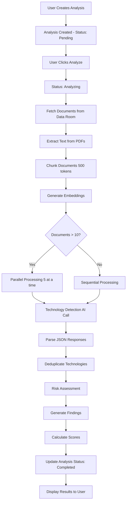

# Tech Stack Due Diligence - Implementation Plan

**Feature**: AI-powered technology stack verification to identify genuine AI capabilities vs. GPT wrappers
**Timeline**: 5-7 days
**Priority**: High - Critical for M&A due diligence
**Status**: Planning Phase

---

## Executive Summary

This feature enables investors to automatically analyze target companies' technical documentation to:
- **Identify claimed technologies** (languages, frameworks, AI models, infrastructure)
- **Verify AI authenticity** - Distinguish proprietary AI vs. GPT wrappers
- **Assess technical debt** - Detect outdated dependencies, security vulnerabilities
- **Score modernization level** - Rate stack maturity (0-100 scale)
- **Flag IP risks** - Open source licensing, third-party dependencies
- **Generate technical reports** - Executive summaries with evidence citations

**Expected Value**: Reduce technical due diligence time from 2-3 weeks to 2-3 hours

---

## Architecture Overview

### Integration Pattern
Follows **Deal Hypothesis Tracker** architecture:
- Repository pattern for database operations
- AI analyzer with vector search integration
- API routes with Zod validation
- React UI components with real-time updates
- RLS policies inheriting from data_rooms

### Tech Stack
- **AI**: Claude Sonnet 3.5 (complex reasoning), Haiku (speed)
- **Vector Search**: pgvector + OpenAI embeddings (reuse Q&A infrastructure)
- **Database**: PostgreSQL with triggers for denormalized counts
- **Frontend**: React + shadcn/ui + Zustand
- **API**: Next.js App Router with Supabase RLS

---

## Database Schema Design

### Core Tables

#### 1. `tech_stack_analyses`
**Purpose**: Main analysis entity with aggregate scores

```sql
-- Enums
CREATE TYPE tech_risk_level AS ENUM ('low', 'medium', 'high', 'critical');
CREATE TYPE analysis_status AS ENUM ('pending', 'analyzing', 'completed', 'failed');

-- Main table
CREATE TABLE tech_stack_analyses (
  id UUID PRIMARY KEY DEFAULT uuid_generate_v4(),
  data_room_id UUID NOT NULL REFERENCES data_rooms(id) ON DELETE CASCADE,
  created_by UUID NOT NULL REFERENCES profiles(id) ON DELETE CASCADE,

  -- Analysis metadata
  title TEXT NOT NULL,
  description TEXT,
  status analysis_status NOT NULL DEFAULT 'pending',

  -- Aggregate scores (denormalized for performance)
  technologies_identified INTEGER NOT NULL DEFAULT 0,
  risk_level tech_risk_level,
  modernization_score INTEGER CHECK (modernization_score >= 0 AND modernization_score <= 100),
  ai_authenticity_score INTEGER CHECK (ai_authenticity_score >= 0 AND ai_authenticity_score <= 100),
  technical_debt_score INTEGER CHECK (technical_debt_score >= 0 AND technical_debt_score <= 100),

  -- Category counts
  frontend_count INTEGER DEFAULT 0,
  backend_count INTEGER DEFAULT 0,
  database_count INTEGER DEFAULT 0,
  infrastructure_count INTEGER DEFAULT 0,
  ai_ml_count INTEGER DEFAULT 0,

  -- AI analysis metadata
  ai_model TEXT, -- e.g., 'anthropic/claude-3.5-sonnet'
  analysis_time_ms INTEGER,
  documents_analyzed INTEGER DEFAULT 0,

  -- Tags and metadata
  tags TEXT[] DEFAULT '{}',
  metadata JSONB DEFAULT '{}'::jsonb,

  -- Timestamps
  created_at TIMESTAMPTZ NOT NULL DEFAULT NOW(),
  updated_at TIMESTAMPTZ NOT NULL DEFAULT NOW(),
  last_analyzed_at TIMESTAMPTZ,
  deleted_at TIMESTAMPTZ
);

-- Indexes
CREATE INDEX idx_tech_stack_analyses_data_room ON tech_stack_analyses(data_room_id) WHERE deleted_at IS NULL;
CREATE INDEX idx_tech_stack_analyses_created_by ON tech_stack_analyses(created_by);
CREATE INDEX idx_tech_stack_analyses_status ON tech_stack_analyses(status);
CREATE INDEX idx_tech_stack_analyses_risk ON tech_stack_analyses(risk_level);
CREATE INDEX idx_tech_stack_analyses_created_at ON tech_stack_analyses(created_at DESC);
```

#### 2. `tech_stack_technologies`
**Purpose**: Individual technologies detected with evidence

```sql
-- Enums
CREATE TYPE tech_category AS ENUM (
  'frontend',          -- React, Vue, Angular
  'backend',           -- Node.js, Python, Java
  'database',          -- PostgreSQL, MongoDB, Redis
  'infrastructure',    -- AWS, GCP, Kubernetes
  'devops',            -- Docker, GitHub Actions, Jenkins
  'ml_ai',             -- TensorFlow, PyTorch, OpenAI
  'security',          -- Auth0, OAuth, encryption
  'testing',           -- Jest, Pytest, Cypress
  'monitoring',        -- DataDog, Sentry, Prometheus
  'other'
);

CREATE TYPE tech_authenticity AS ENUM (
  'proprietary',       -- Custom-built AI models
  'wrapper',           -- GPT API wrapper
  'hybrid',            -- Mix of custom + third-party
  'third_party',       -- Pure third-party service
  'unknown'
);

-- Technologies table
CREATE TABLE tech_stack_technologies (
  id UUID PRIMARY KEY DEFAULT uuid_generate_v4(),
  analysis_id UUID NOT NULL REFERENCES tech_stack_analyses(id) ON DELETE CASCADE,

  -- Technology details
  name TEXT NOT NULL,                    -- e.g., "TensorFlow", "GPT-4"
  category tech_category NOT NULL,
  version TEXT,                          -- e.g., "2.15.0", ">=3.0.0"
  authenticity tech_authenticity,        -- AI classification

  -- Confidence and risk
  confidence_score DECIMAL(3,2) NOT NULL CHECK (confidence_score >= 0 AND confidence_score <= 1),
  risk_score INTEGER CHECK (risk_score >= 0 AND risk_score <= 100),
  is_outdated BOOLEAN DEFAULT false,
  is_deprecated BOOLEAN DEFAULT false,

  -- Evidence (source attribution)
  source_document_id UUID REFERENCES documents(id) ON DELETE SET NULL,
  source_page_number INTEGER,
  excerpt_text TEXT,                     -- Max 500 chars
  chunk_id UUID,                         -- Reference to document_chunks for deep linking

  -- AI reasoning
  ai_reasoning TEXT,                     -- Why this was detected
  ai_confidence DECIMAL(3,2),            -- AI's confidence in detection

  -- License and dependencies
  license_type TEXT,                     -- e.g., "MIT", "Apache 2.0", "Proprietary"
  has_security_issues BOOLEAN DEFAULT false,
  security_details TEXT,

  -- Notes
  manual_note TEXT,
  manually_verified BOOLEAN DEFAULT false,
  verified_by UUID REFERENCES profiles(id) ON DELETE SET NULL,
  verified_at TIMESTAMPTZ,

  -- Timestamps
  created_at TIMESTAMPTZ NOT NULL DEFAULT NOW(),
  updated_at TIMESTAMPTZ NOT NULL DEFAULT NOW()
);

-- Indexes
CREATE INDEX idx_tech_stack_technologies_analysis ON tech_stack_technologies(analysis_id);
CREATE INDEX idx_tech_stack_technologies_category ON tech_stack_technologies(category);
CREATE INDEX idx_tech_stack_technologies_authenticity ON tech_stack_technologies(authenticity);
CREATE INDEX idx_tech_stack_technologies_document ON tech_stack_technologies(source_document_id) WHERE source_document_id IS NOT NULL;
CREATE INDEX idx_tech_stack_technologies_risk ON tech_stack_technologies(risk_score DESC);

-- Unique constraint: prevent duplicate detections
CREATE UNIQUE INDEX idx_tech_stack_technologies_unique
ON tech_stack_technologies(analysis_id, name, category, version)
WHERE deleted_at IS NULL;
```

#### 3. `tech_stack_findings`
**Purpose**: Red flags, risks, and recommendations

```sql
-- Enums
CREATE TYPE finding_type AS ENUM (
  'red_flag',          -- Critical issue
  'risk',              -- Potential problem
  'opportunity',       -- Improvement opportunity
  'strength',          -- Positive finding
  'recommendation'     -- Actionable suggestion
);

CREATE TYPE finding_severity AS ENUM ('critical', 'high', 'medium', 'low', 'info');

-- Findings table
CREATE TABLE tech_stack_findings (
  id UUID PRIMARY KEY DEFAULT uuid_generate_v4(),
  analysis_id UUID NOT NULL REFERENCES tech_stack_analyses(id) ON DELETE CASCADE,

  -- Finding details
  finding_type finding_type NOT NULL,
  severity finding_severity NOT NULL,
  title TEXT NOT NULL,
  description TEXT NOT NULL,

  -- Related technologies
  related_technology_ids UUID[] DEFAULT '{}',

  -- Evidence
  evidence_text TEXT,
  source_documents UUID[] DEFAULT '{}',

  -- Impact assessment
  impact_description TEXT,
  mitigation_steps TEXT[],
  estimated_cost_to_fix TEXT,        -- e.g., "3-6 months", "$50k-$100k"

  -- Status
  is_addressed BOOLEAN DEFAULT false,
  addressed_by UUID REFERENCES profiles(id) ON DELETE SET NULL,
  addressed_at TIMESTAMPTZ,
  resolution_notes TEXT,

  -- Timestamps
  created_at TIMESTAMPTZ NOT NULL DEFAULT NOW(),
  updated_at TIMESTAMPTZ NOT NULL DEFAULT NOW()
);

-- Indexes
CREATE INDEX idx_tech_stack_findings_analysis ON tech_stack_findings(analysis_id);
CREATE INDEX idx_tech_stack_findings_type ON tech_stack_findings(finding_type);
CREATE INDEX idx_tech_stack_findings_severity ON tech_stack_findings(severity);
CREATE INDEX idx_tech_stack_findings_created_at ON tech_stack_findings(created_at DESC);
```

#### 4. `tech_stack_comparisons`
**Purpose**: Compare tech stacks across multiple companies

```sql
CREATE TABLE tech_stack_comparisons (
  id UUID PRIMARY KEY DEFAULT uuid_generate_v4(),
  created_by UUID NOT NULL REFERENCES profiles(id) ON DELETE CASCADE,

  -- Comparison metadata
  title TEXT NOT NULL,
  description TEXT,
  analysis_ids UUID[] NOT NULL,     -- Array of tech_stack_analyses.id

  -- Comparison results (JSONB for flexibility)
  comparison_matrix JSONB,          -- Technology overlap matrix
  strengths_weaknesses JSONB,       -- Per-company analysis
  recommendations TEXT,              -- AI-generated recommendations

  -- Timestamps
  created_at TIMESTAMPTZ NOT NULL DEFAULT NOW(),
  updated_at TIMESTAMPTZ NOT NULL DEFAULT NOW()
);

CREATE INDEX idx_tech_stack_comparisons_created_by ON tech_stack_comparisons(created_by);
```

### Auto-Update Triggers

```sql
-- Update technology counts when technologies are added/removed
CREATE OR REPLACE FUNCTION update_tech_stack_counts()
RETURNS TRIGGER AS $$
BEGIN
  UPDATE tech_stack_analyses
  SET
    technologies_identified = (
      SELECT COUNT(*) FROM tech_stack_technologies
      WHERE analysis_id = COALESCE(NEW.analysis_id, OLD.analysis_id)
    ),
    frontend_count = (
      SELECT COUNT(*) FROM tech_stack_technologies
      WHERE analysis_id = COALESCE(NEW.analysis_id, OLD.analysis_id)
      AND category = 'frontend'
    ),
    backend_count = (
      SELECT COUNT(*) FROM tech_stack_technologies
      WHERE analysis_id = COALESCE(NEW.analysis_id, OLD.analysis_id)
      AND category = 'backend'
    ),
    database_count = (
      SELECT COUNT(*) FROM tech_stack_technologies
      WHERE analysis_id = COALESCE(NEW.analysis_id, OLD.analysis_id)
      AND category = 'database'
    ),
    infrastructure_count = (
      SELECT COUNT(*) FROM tech_stack_technologies
      WHERE analysis_id = COALESCE(NEW.analysis_id, OLD.analysis_id)
      AND category = 'infrastructure'
    ),
    ai_ml_count = (
      SELECT COUNT(*) FROM tech_stack_technologies
      WHERE analysis_id = COALESCE(NEW.analysis_id, OLD.analysis_id)
      AND category = 'ml_ai'
    ),
    updated_at = NOW()
  WHERE id = COALESCE(NEW.analysis_id, OLD.analysis_id);
  RETURN COALESCE(NEW, OLD);
END;
$$ LANGUAGE plpgsql;

CREATE TRIGGER trigger_update_tech_stack_counts
AFTER INSERT OR DELETE OR UPDATE OF category ON tech_stack_technologies
FOR EACH ROW EXECUTE FUNCTION update_tech_stack_counts();

-- Calculate aggregate scores when findings/technologies change
CREATE OR REPLACE FUNCTION calculate_tech_stack_scores()
RETURNS TRIGGER AS $$
DECLARE
  v_analysis_id UUID;
  v_avg_risk NUMERIC;
  v_critical_count INTEGER;
  v_high_count INTEGER;
BEGIN
  v_analysis_id := COALESCE(NEW.analysis_id, OLD.analysis_id);

  -- Calculate average risk score from technologies
  SELECT AVG(risk_score), COUNT(*) FILTER (WHERE risk_score >= 75), COUNT(*) FILTER (WHERE risk_score >= 50 AND risk_score < 75)
  INTO v_avg_risk, v_critical_count, v_high_count
  FROM tech_stack_technologies
  WHERE analysis_id = v_analysis_id;

  -- Update risk level
  UPDATE tech_stack_analyses
  SET
    risk_level = CASE
      WHEN v_critical_count > 0 THEN 'critical'::tech_risk_level
      WHEN v_high_count > 0 THEN 'high'::tech_risk_level
      WHEN v_avg_risk >= 30 THEN 'medium'::tech_risk_level
      ELSE 'low'::tech_risk_level
    END,
    updated_at = NOW()
  WHERE id = v_analysis_id;

  RETURN COALESCE(NEW, OLD);
END;
$$ LANGUAGE plpgsql;

CREATE TRIGGER trigger_calculate_tech_stack_scores
AFTER INSERT OR UPDATE OF risk_score ON tech_stack_technologies
FOR EACH ROW EXECUTE FUNCTION calculate_tech_stack_scores();
```

### RLS Policies

```sql
-- Enable RLS
ALTER TABLE tech_stack_analyses ENABLE ROW LEVEL SECURITY;
ALTER TABLE tech_stack_technologies ENABLE ROW LEVEL SECURITY;
ALTER TABLE tech_stack_findings ENABLE ROW LEVEL SECURITY;
ALTER TABLE tech_stack_comparisons ENABLE ROW LEVEL SECURITY;

-- Policies inherit from data_rooms access
CREATE POLICY tech_stack_analyses_select ON tech_stack_analyses
FOR SELECT USING (
  data_room_id IN (
    SELECT id FROM data_rooms WHERE user_id = auth.uid()
    UNION
    SELECT data_room_id FROM data_room_access
    WHERE user_id = auth.uid()
    AND revoked_at IS NULL
    AND expires_at > NOW()
  )
);

CREATE POLICY tech_stack_analyses_insert ON tech_stack_analyses
FOR INSERT WITH CHECK (
  data_room_id IN (
    SELECT id FROM data_rooms WHERE user_id = auth.uid()
    UNION
    SELECT data_room_id FROM data_room_access
    WHERE user_id = auth.uid()
    AND permission_level IN ('owner', 'editor')
    AND revoked_at IS NULL
    AND expires_at > NOW()
  )
);

CREATE POLICY tech_stack_analyses_update ON tech_stack_analyses
FOR UPDATE USING (
  data_room_id IN (
    SELECT id FROM data_rooms WHERE user_id = auth.uid()
    UNION
    SELECT data_room_id FROM data_room_access
    WHERE user_id = auth.uid()
    AND permission_level IN ('owner', 'editor')
    AND revoked_at IS NULL
    AND expires_at > NOW()
  )
);

CREATE POLICY tech_stack_analyses_delete ON tech_stack_analyses
FOR DELETE USING (
  data_room_id IN (
    SELECT id FROM data_rooms WHERE user_id = auth.uid()
  )
);

-- Technologies policies (inherit from analyses)
CREATE POLICY tech_stack_technologies_select ON tech_stack_technologies
FOR SELECT USING (
  analysis_id IN (SELECT id FROM tech_stack_analyses)
);

CREATE POLICY tech_stack_technologies_all ON tech_stack_technologies
FOR ALL USING (
  analysis_id IN (SELECT id FROM tech_stack_analyses)
);

-- Findings policies (inherit from analyses)
CREATE POLICY tech_stack_findings_select ON tech_stack_findings
FOR SELECT USING (
  analysis_id IN (SELECT id FROM tech_stack_analyses)
);

CREATE POLICY tech_stack_findings_all ON tech_stack_findings
FOR ALL USING (
  analysis_id IN (SELECT id FROM tech_stack_analyses)
);

-- Comparisons policies
CREATE POLICY tech_stack_comparisons_select ON tech_stack_comparisons
FOR SELECT USING (created_by = auth.uid());

CREATE POLICY tech_stack_comparisons_all ON tech_stack_comparisons
FOR ALL USING (created_by = auth.uid());
```

---

## TypeScript Type Definitions

**File**: `lib/data-room/types.ts` (append to existing file)

```typescript
// ============================================
// TECH STACK DUE DILIGENCE TYPES
// ============================================

export type TechRiskLevel = 'low' | 'medium' | 'high' | 'critical';
export type AnalysisStatus = 'pending' | 'analyzing' | 'completed' | 'failed';
export type TechCategory = 'frontend' | 'backend' | 'database' | 'infrastructure' | 'devops' | 'ml_ai' | 'security' | 'testing' | 'monitoring' | 'other';
export type TechAuthenticity = 'proprietary' | 'wrapper' | 'hybrid' | 'third_party' | 'unknown';
export type FindingType = 'red_flag' | 'risk' | 'opportunity' | 'strength' | 'recommendation';
export type FindingSeverity = 'critical' | 'high' | 'medium' | 'low' | 'info';

export interface TechStackAnalysis {
  id: string;
  data_room_id: string;
  created_by: string;
  title: string;
  description: string | null;
  status: AnalysisStatus;

  // Aggregate scores
  technologies_identified: number;
  risk_level: TechRiskLevel | null;
  modernization_score: number | null;
  ai_authenticity_score: number | null;
  technical_debt_score: number | null;

  // Category counts
  frontend_count: number;
  backend_count: number;
  database_count: number;
  infrastructure_count: number;
  ai_ml_count: number;

  // AI metadata
  ai_model: string | null;
  analysis_time_ms: number | null;
  documents_analyzed: number;

  tags: string[];
  metadata: Record<string, unknown>;

  created_at: string;
  updated_at: string;
  last_analyzed_at: string | null;
  deleted_at: string | null;
}

export interface TechStackTechnology {
  id: string;
  analysis_id: string;
  name: string;
  category: TechCategory;
  version: string | null;
  authenticity: TechAuthenticity | null;

  confidence_score: number;
  risk_score: number | null;
  is_outdated: boolean;
  is_deprecated: boolean;

  source_document_id: string | null;
  source_page_number: number | null;
  excerpt_text: string | null;
  chunk_id: string | null;

  ai_reasoning: string | null;
  ai_confidence: number | null;

  license_type: string | null;
  has_security_issues: boolean;
  security_details: string | null;

  manual_note: string | null;
  manually_verified: boolean;
  verified_by: string | null;
  verified_at: string | null;

  created_at: string;
  updated_at: string;
}

export interface TechStackFinding {
  id: string;
  analysis_id: string;
  finding_type: FindingType;
  severity: FindingSeverity;
  title: string;
  description: string;

  related_technology_ids: string[];
  evidence_text: string | null;
  source_documents: string[];

  impact_description: string | null;
  mitigation_steps: string[] | null;
  estimated_cost_to_fix: string | null;

  is_addressed: boolean;
  addressed_by: string | null;
  addressed_at: string | null;
  resolution_notes: string | null;

  created_at: string;
  updated_at: string;
}

export interface TechStackComparison {
  id: string;
  created_by: string;
  title: string;
  description: string | null;
  analysis_ids: string[];
  comparison_matrix: Record<string, unknown> | null;
  strengths_weaknesses: Record<string, unknown> | null;
  recommendations: string | null;
  created_at: string;
  updated_at: string;
}

// API Request/Response types
export interface CreateTechStackAnalysisRequest {
  data_room_id: string;
  title: string;
  description?: string;
  tags?: string[];
}

export interface UpdateTechStackAnalysisRequest {
  title?: string;
  description?: string;
  tags?: string[];
}

export interface TriggerAnalysisRequest {
  document_ids?: string[]; // Optional: analyze specific documents only
  categories?: TechCategory[]; // Optional: focus on specific categories
}

export interface TechStackAnalysisResult {
  analysis: TechStackAnalysis;
  technologies: TechStackTechnology[];
  findings: TechStackFinding[];
}
```

---

## Implementation Timeline

### **Day 1: Database & Core Infrastructure**
**Goal**: Set up database schema and repository layer

**Tasks**:
1. ✅ Create migration file `supabase/migrations/YYYYMMDD_tech_stack_analysis.sql`
   - Define enums, tables, indexes
   - Create triggers for auto-updates
   - Set up RLS policies
   - **Deliverable**: Migration applied successfully

2. ✅ Update TypeScript types in `types/database.ts`
   - Add new table types to Database interface
   - Export helper types
   - **Deliverable**: No TypeScript errors

3. ✅ Create `lib/data-room/types.ts` additions
   - Define all interfaces
   - Export types
   - **Deliverable**: Types file updated

4. ✅ Create `lib/data-room/repository/tech-stack-repository.ts`
   - Implement CRUD operations
   - Add error handling with DataRoomError
   - Follow hypothesis-repository pattern
   - **Deliverable**: Repository class complete (~500 lines)

**Success Criteria**:
- [ ] Migration runs without errors
- [ ] All tables created with correct schema
- [ ] Triggers working (test with manual inserts)
- [ ] RLS policies enforced
- [ ] Repository unit tests pass

---

### **Day 2: AI Analysis Engine - Part 1 (Technology Detection)**
**Goal**: Build AI-powered technology detection

**Tasks**:
1. ✅ Create `lib/data-room/tech-stack/technology-detector.ts`
   - Define technology detection prompts
   - Integrate with getUserLLMManager()
   - Parse structured JSON responses
   - **Deliverable**: Technology detector class (~300 lines)

2. ✅ Create technology database/knowledge base
   - Create `lib/data-room/tech-stack/tech-database.ts`
   - Map technology names to categories
   - Define version patterns (regex)
   - Common aliases (e.g., "React.js" → "React")
   - **Deliverable**: Technology reference data

3. ✅ Implement vector search integration
   - Create `lib/data-room/tech-stack/technology-extractor.ts`
   - Reuse retrieveChunks() from Q&A system
   - Find technology mentions in documents
   - **Deliverable**: Vector search integration (~200 lines)

4. ✅ Create AI prompt engineering
   - System prompt for technology detection
   - User prompt template
   - Example responses (few-shot learning)
   - **Deliverable**: Prompt templates

**AI Prompt Example**:
```typescript
const SYSTEM_PROMPT = `You are a technical due diligence expert analyzing company documentation to identify technologies used.

Your task: Extract ALL technologies mentioned including:
- Programming languages (Python, JavaScript, etc.)
- Frameworks (React, Django, TensorFlow, etc.)
- Databases (PostgreSQL, MongoDB, etc.)
- Cloud providers (AWS, GCP, Azure)
- AI/ML tools (GPT-4, custom models, etc.)
- DevOps tools (Docker, Kubernetes, etc.)

For each technology, determine:
1. Name and version (if mentioned)
2. Category (frontend/backend/database/etc.)
3. Authenticity (proprietary/wrapper/third_party)
4. Confidence score (0-1)

For AI technologies specifically, look for:
- "We built our own model" → proprietary
- "Using GPT-4 API" → wrapper
- "Fine-tuned GPT on our data" → hybrid
- Custom training code/architecture → proprietary

Return JSON array of technologies with evidence quotes.`;

const USER_PROMPT = `Analyze this document excerpt and extract all technologies:

"""
${documentText}
"""

Return JSON only (no markdown):
{
  "technologies": [
    {
      "name": "string",
      "category": "frontend|backend|database|infrastructure|ml_ai|etc",
      "version": "string|null",
      "authenticity": "proprietary|wrapper|hybrid|third_party|unknown",
      "confidence": 0.0-1.0,
      "evidence": "exact quote from document",
      "reasoning": "why you classified it this way"
    }
  ]
}`;
```

**Success Criteria**:
- [ ] Correctly identifies 20+ common technologies
- [ ] Distinguishes proprietary AI from wrappers (90%+ accuracy)
- [ ] Confidence scores align with evidence quality
- [ ] Handles edge cases (ambiguous tech names, version formats)

---

### **Day 3: AI Analysis Engine - Part 2 (Risk Assessment & Findings)**
**Goal**: Implement risk scoring and finding generation

**Tasks**:
1. ✅ Create `lib/data-room/tech-stack/risk-assessor.ts`
   - Calculate risk scores per technology
   - Factor in: age, security issues, deprecation, licensing
   - Aggregate to overall risk level
   - **Deliverable**: Risk assessment logic (~250 lines)

2. ✅ Create `lib/data-room/tech-stack/findings-generator.ts`
   - AI-powered red flag detection
   - Generate actionable recommendations
   - Estimate remediation costs
   - **Deliverable**: Findings generator (~300 lines)

3. ✅ Create `lib/data-room/tech-stack/ai-analyzer.ts`
   - Main orchestration class
   - Coordinate all AI analysis steps
   - Update analysis status in real-time
   - **Deliverable**: Main analyzer class (~400 lines)

4. ✅ Implement scoring algorithms
   - Modernization score (0-100)
   - AI authenticity score (0-100)
   - Technical debt score (0-100)
   - **Deliverable**: Scoring functions

**Risk Scoring Logic**:
```typescript
interface RiskFactors {
  ageYears: number;           // Years since last major version
  hasSecurityIssues: boolean;
  isDeprecated: boolean;
  licenseRisk: 'low' | 'medium' | 'high'; // GPL vs. MIT vs. proprietary
  communityActivity: 'active' | 'declining' | 'dead';
}

function calculateRiskScore(tech: TechStackTechnology, factors: RiskFactors): number {
  let score = 0;

  // Age penalty (max 30 points)
  if (factors.ageYears > 5) score += 30;
  else if (factors.ageYears > 3) score += 20;
  else if (factors.ageYears > 1) score += 10;

  // Security (max 40 points)
  if (factors.hasSecurityIssues) score += 40;

  // Deprecation (max 20 points)
  if (factors.isDeprecated) score += 20;

  // License risk (max 10 points)
  if (factors.licenseRisk === 'high') score += 10;
  else if (factors.licenseRisk === 'medium') score += 5;

  return Math.min(score, 100);
}
```

**Success Criteria**:
- [ ] Risk scores are explainable and auditable
- [ ] Findings categorized correctly (red_flag vs. risk vs. opportunity)
- [ ] Severity levels match actual business impact
- [ ] Recommendations are actionable

---

### **Day 4: API Routes & Backend Integration**
**Goal**: Build API endpoints with validation and access control

**Tasks**:
1. ✅ Create `app/api/data-room/tech-stack/route.ts`
   - POST: Create new analysis
   - GET: List analyses for data room
   - **Deliverable**: API route (~200 lines)

2. ✅ Create `app/api/data-room/tech-stack/[id]/route.ts`
   - GET: Retrieve single analysis with details
   - PATCH: Update analysis metadata
   - DELETE: Soft delete analysis
   - **Deliverable**: API route (~250 lines)

3. ✅ Create `app/api/data-room/tech-stack/[id]/analyze/route.ts`
   - POST: Trigger AI analysis
   - Handle async processing
   - Update status in real-time
   - **Deliverable**: API route (~300 lines)

4. ✅ Create `app/api/data-room/tech-stack/[id]/export/route.ts`
   - GET: Export analysis as PDF/Excel
   - Include executive summary
   - **Deliverable**: Export route (~150 lines)

5. ✅ Add Zod validation schemas
   - Request validation
   - Type-safe parsing
   - **Deliverable**: Validation schemas

**API Route Example**:
```typescript
// app/api/data-room/tech-stack/route.ts
import { NextRequest, NextResponse } from 'next/server';
import { createClient } from '@/lib/supabase/server';
import { z } from 'zod';
import { TechStackRepository } from '@/lib/data-room/repository/tech-stack-repository';

const CreateSchema = z.object({
  data_room_id: z.string().uuid(),
  title: z.string().min(1).max(200),
  description: z.string().max(2000).optional(),
  tags: z.array(z.string()).optional()
});

export async function POST(req: NextRequest) {
  try {
    const supabase = await createClient();
    const { data: { user } } = await supabase.auth.getUser();
    if (!user) {
      return NextResponse.json({ error: 'Unauthorized' }, { status: 401 });
    }

    const body = await req.json();
    const validated = CreateSchema.parse(body);

    // Check data room access (owner or editor)
    const { data: dataRoom } = await supabase
      .from('data_rooms')
      .select('id, user_id')
      .eq('id', validated.data_room_id)
      .single();

    if (!dataRoom) {
      return NextResponse.json({ error: 'Data room not found' }, { status: 404 });
    }

    const isOwner = dataRoom.user_id === user.id;

    if (!isOwner) {
      const { data: access } = await supabase
        .from('data_room_access')
        .select('permission_level')
        .eq('data_room_id', validated.data_room_id)
        .eq('user_id', user.id)
        .is('revoked_at', null)
        .gt('expires_at', new Date().toISOString())
        .single();

      if (!access || !['owner', 'editor'].includes(access.permission_level)) {
        return NextResponse.json({ error: 'Forbidden' }, { status: 403 });
      }
    }

    // Create analysis via repository
    const repo = new TechStackRepository(supabase);
    const analysis = await repo.createAnalysis(validated, user.id);

    // Log activity
    await supabase.from('activity_logs').insert({
      data_room_id: validated.data_room_id,
      actor_id: user.id,
      actor_name: user.user_metadata?.name || 'Unknown',
      actor_email: user.email || '',
      action: 'create_tech_stack_analysis',
      details: { analysis_id: analysis.id },
      ip_address: req.headers.get('x-forwarded-for') || req.headers.get('x-real-ip'),
      user_agent: req.headers.get('user-agent')
    });

    return NextResponse.json({ success: true, data: analysis }, { status: 201 });

  } catch (error) {
    if (error instanceof z.ZodError) {
      return NextResponse.json({ error: 'Validation failed', details: error.errors }, { status: 400 });
    }
    console.error('Failed to create tech stack analysis:', error);
    return NextResponse.json({ error: 'Failed to create analysis' }, { status: 500 });
  }
}

export async function GET(req: NextRequest) {
  try {
    const supabase = await createClient();
    const { data: { user } } = await supabase.auth.getUser();
    if (!user) {
      return NextResponse.json({ error: 'Unauthorized' }, { status: 401 });
    }

    const { searchParams } = new URL(req.url);
    const dataRoomId = searchParams.get('data_room_id');

    if (!dataRoomId) {
      return NextResponse.json({ error: 'data_room_id required' }, { status: 400 });
    }

    const repo = new TechStackRepository(supabase);
    const analyses = await repo.listAnalyses(dataRoomId);

    return NextResponse.json({ success: true, data: analyses });

  } catch (error) {
    console.error('Failed to fetch tech stack analyses:', error);
    return NextResponse.json({ error: 'Failed to fetch analyses' }, { status: 500 });
  }
}
```

**Success Criteria**:
- [ ] All endpoints return correct status codes
- [ ] Validation catches invalid inputs
- [ ] Access control prevents unauthorized access
- [ ] Activity logs captured for audit trail
- [ ] API documentation complete

---

### **Day 5: React UI Components - Part 1**
**Goal**: Build core UI components

**Tasks**:
1. ✅ Create `components/data-room/tech-stack/tech-stack-list.tsx`
   - List view with filters (status, risk level)
   - Grid/list toggle
   - Search functionality
   - **Deliverable**: List component (~300 lines)

2. ✅ Create `components/data-room/tech-stack/tech-stack-card.tsx`
   - Card component for grid view
   - Summary stats display
   - Action buttons
   - **Deliverable**: Card component (~150 lines)

3. ✅ Create `components/data-room/tech-stack/create-analysis-dialog.tsx`
   - Modal form for creating analysis
   - Form validation with react-hook-form
   - **Deliverable**: Dialog component (~200 lines)

4. ✅ Create `components/data-room/tech-stack/analysis-status-badge.tsx`
   - Status badge component
   - Color coding
   - **Deliverable**: Badge component (~50 lines)

**Component Example**:
```typescript
'use client';

import { useState, useEffect, useCallback } from 'react';
import { Button } from '@/components/ui/button';
import { Input } from '@/components/ui/input';
import { Select, SelectContent, SelectItem, SelectTrigger, SelectValue } from '@/components/ui/select';
import { Plus, Search, Filter, Grid3x3, List } from 'lucide-react';
import { TechStackCard } from './tech-stack-card';
import { CreateAnalysisDialog } from './create-analysis-dialog';
import type { TechStackAnalysis } from '@/lib/data-room/types';

interface TechStackListProps {
  dataRoomId: string;
}

export function TechStackList({ dataRoomId }: TechStackListProps) {
  const [analyses, setAnalyses] = useState<TechStackAnalysis[]>([]);
  const [loading, setLoading] = useState(true);
  const [searchQuery, setSearchQuery] = useState('');
  const [statusFilter, setStatusFilter] = useState<string>('all');
  const [riskFilter, setRiskFilter] = useState<string>('all');
  const [viewMode, setViewMode] = useState<'grid' | 'list'>('grid');
  const [showCreateDialog, setShowCreateDialog] = useState(false);

  const fetchAnalyses = useCallback(async () => {
    setLoading(true);
    try {
      const response = await fetch(`/api/data-room/tech-stack?data_room_id=${dataRoomId}`);
      const data = await response.json();
      if (data.success) {
        setAnalyses(data.data);
      }
    } catch (error) {
      console.error('Failed to fetch analyses:', error);
    } finally {
      setLoading(false);
    }
  }, [dataRoomId]);

  useEffect(() => {
    fetchAnalyses();
  }, [fetchAnalyses]);

  // Filter analyses
  const filteredAnalyses = analyses.filter(analysis => {
    const matchesSearch = analysis.title.toLowerCase().includes(searchQuery.toLowerCase());
    const matchesStatus = statusFilter === 'all' || analysis.status === statusFilter;
    const matchesRisk = riskFilter === 'all' || analysis.risk_level === riskFilter;
    return matchesSearch && matchesStatus && matchesRisk;
  });

  return (
    <div className="space-y-6">
      {/* Header */}
      <div className="flex items-center justify-between">
        <div>
          <h2 className="text-2xl font-bold">Tech Stack Analysis</h2>
          <p className="text-sm text-muted-foreground">
            AI-powered technology due diligence • {analyses.length} analyses
          </p>
        </div>
        <Button onClick={() => setShowCreateDialog(true)}>
          <Plus className="h-4 w-4 mr-2" />
          New Analysis
        </Button>
      </div>

      {/* Filters */}
      <div className="flex items-center gap-4">
        <div className="relative flex-1">
          <Search className="absolute left-3 top-1/2 transform -translate-y-1/2 h-4 w-4 text-muted-foreground" />
          <Input
            placeholder="Search analyses..."
            value={searchQuery}
            onChange={(e) => setSearchQuery(e.target.value)}
            className="pl-9"
          />
        </div>

        <Select value={statusFilter} onValueChange={setStatusFilter}>
          <SelectTrigger className="w-[150px]">
            <SelectValue placeholder="Status" />
          </SelectTrigger>
          <SelectContent>
            <SelectItem value="all">All Status</SelectItem>
            <SelectItem value="pending">Pending</SelectItem>
            <SelectItem value="analyzing">Analyzing</SelectItem>
            <SelectItem value="completed">Completed</SelectItem>
            <SelectItem value="failed">Failed</SelectItem>
          </SelectContent>
        </Select>

        <Select value={riskFilter} onValueChange={setRiskFilter}>
          <SelectTrigger className="w-[150px]">
            <SelectValue placeholder="Risk Level" />
          </SelectTrigger>
          <SelectContent>
            <SelectItem value="all">All Risks</SelectItem>
            <SelectItem value="low">Low</SelectItem>
            <SelectItem value="medium">Medium</SelectItem>
            <SelectItem value="high">High</SelectItem>
            <SelectItem value="critical">Critical</SelectItem>
          </SelectContent>
        </Select>

        <div className="flex items-center gap-1 border rounded-md">
          <Button
            variant={viewMode === 'grid' ? 'secondary' : 'ghost'}
            size="sm"
            onClick={() => setViewMode('grid')}
          >
            <Grid3x3 className="h-4 w-4" />
          </Button>
          <Button
            variant={viewMode === 'list' ? 'secondary' : 'ghost'}
            size="sm"
            onClick={() => setViewMode('list')}
          >
            <List className="h-4 w-4" />
          </Button>
        </div>
      </div>

      {/* Content */}
      {loading ? (
        <div className="grid grid-cols-1 md:grid-cols-2 lg:grid-cols-3 gap-6">
          {[...Array(6)].map((_, i) => (
            <div key={i} className="h-64 bg-muted animate-pulse rounded-lg" />
          ))}
        </div>
      ) : filteredAnalyses.length === 0 ? (
        <div className="text-center py-12">
          <Filter className="h-12 w-12 mx-auto text-muted-foreground mb-4" />
          <h3 className="text-lg font-semibold mb-2">No analyses found</h3>
          <p className="text-sm text-muted-foreground mb-4">
            {searchQuery || statusFilter !== 'all' || riskFilter !== 'all'
              ? 'Try adjusting your filters'
              : 'Create your first tech stack analysis'}
          </p>
          {!searchQuery && statusFilter === 'all' && riskFilter === 'all' && (
            <Button onClick={() => setShowCreateDialog(true)}>
              <Plus className="h-4 w-4 mr-2" />
              Create Analysis
            </Button>
          )}
        </div>
      ) : (
        <div className={
          viewMode === 'grid'
            ? 'grid grid-cols-1 md:grid-cols-2 lg:grid-cols-3 gap-6'
            : 'space-y-4'
        }>
          {filteredAnalyses.map(analysis => (
            <TechStackCard
              key={analysis.id}
              analysis={analysis}
              viewMode={viewMode}
              onRefresh={fetchAnalyses}
            />
          ))}
        </div>
      )}

      {/* Create Dialog */}
      <CreateAnalysisDialog
        open={showCreateDialog}
        onOpenChange={setShowCreateDialog}
        dataRoomId={dataRoomId}
        onSuccess={fetchAnalyses}
      />
    </div>
  );
}
```

**Success Criteria**:
- [ ] List renders correctly with loading/empty states
- [ ] Filters work (search, status, risk level)
- [ ] View toggle works (grid/list)
- [ ] Create dialog validates inputs
- [ ] UI follows shadcn/ui design patterns

---

### **Day 6: React UI Components - Part 2**
**Goal**: Build detail views and analysis interface

**Tasks**:
1. ✅ Create `components/data-room/tech-stack/tech-stack-detail.tsx`
   - Full analysis detail view
   - Tabs for technologies/findings/summary
   - **Deliverable**: Detail component (~400 lines)

2. ✅ Create `components/data-room/tech-stack/technology-table.tsx`
   - Sortable table of detected technologies
   - Category filters
   - Risk indicators
   - **Deliverable**: Table component (~300 lines)

3. ✅ Create `components/data-room/tech-stack/findings-list.tsx`
   - List of red flags and recommendations
   - Severity badges
   - Action buttons (mark as addressed)
   - **Deliverable**: Findings component (~250 lines)

4. ✅ Create `components/data-room/tech-stack/ai-analysis-panel.tsx`
   - Trigger analysis button
   - Real-time progress indicator
   - Status updates
   - **Deliverable**: Analysis panel (~200 lines)

5. ✅ Create `components/data-room/tech-stack/executive-summary.tsx`
   - High-level overview
   - Key metrics visualization
   - Export button
   - **Deliverable**: Summary component (~200 lines)

**Success Criteria**:
- [ ] Detail view loads quickly
- [ ] Tables are sortable and filterable
- [ ] Real-time updates work during analysis
- [ ] Export generates proper PDF/Excel
- [ ] All components are accessible (WCAG AA)

---

### **Day 7: Testing, Polish & Documentation**
**Goal**: Ensure quality and prepare for production

**Tasks**:
1. ✅ Integration testing
   - Test full analysis flow end-to-end
   - Verify AI accuracy with sample docs
   - Test edge cases (no tech found, errors, etc.)
   - **Deliverable**: Test cases pass

2. ✅ Performance optimization
   - Add database indexes if needed
   - Optimize AI prompts for speed
   - Cache frequently accessed data
   - **Deliverable**: Performance benchmarks met

3. ✅ Error handling & edge cases
   - Graceful failures
   - Retry logic for AI errors
   - User-friendly error messages
   - **Deliverable**: Error scenarios handled

4. ✅ Documentation
   - API documentation (OpenAPI/Swagger)
   - User guide for feature
   - Developer setup instructions
   - **Deliverable**: Documentation complete

5. ✅ Code review & cleanup
   - Remove console.logs
   - Add code comments
   - Ensure TypeScript strict mode
   - **Deliverable**: Code review approved

6. ✅ Deploy to staging
   - Run migrations on staging DB
   - Deploy code to staging environment
   - Smoke test all flows
   - **Deliverable**: Staging deployment successful

**Success Criteria**:
- [ ] All tests pass (unit + integration)
- [ ] Performance targets met (<7s analysis)
- [ ] Zero TypeScript errors
- [ ] Documentation complete
- [ ] Ready for production deployment

---

## AI Analysis Workflow

### Step-by-Step Process



### Detailed Algorithm

```typescript
async function analyzeDataRoom(analysisId: string, userId: string): Promise<void> {
  const startTime = Date.now();

  try {
    // 1. Update status
    await repo.updateAnalysisStatus(analysisId, 'analyzing');

    // 2. Fetch documents from data room
    const analysis = await repo.getAnalysis(analysisId);
    const documents = await repo.getDocumentsForAnalysis(analysis.data_room_id);

    // 3. Extract text from documents (reuse Q&A infrastructure)
    const documentTexts = await Promise.all(
      documents.map(doc => extractTextFromDocument(doc.id))
    );

    // 4. Detect technologies using AI
    const allTechnologies: TechStackTechnology[] = [];

    for (const { doc, text } of documentTexts) {
      // Chunk text into ~4000 char segments (to fit in context window)
      const chunks = chunkText(text, 4000);

      for (const chunk of chunks) {
        const detected = await detector.detectTechnologies(chunk, userId);
        allTechnologies.push(...detected.map(tech => ({
          ...tech,
          analysis_id: analysisId,
          source_document_id: doc.id
        })));
      }
    }

    // 5. Deduplicate technologies (same name + version)
    const uniqueTechnologies = deduplicateTechnologies(allTechnologies);

    // 6. Save technologies to database
    await repo.bulkInsertTechnologies(uniqueTechnologies);

    // 7. Assess risks for each technology
    const riskAssessments = await Promise.all(
      uniqueTechnologies.map(tech => assessor.assessRisk(tech))
    );

    await repo.bulkUpdateTechnologyRisks(riskAssessments);

    // 8. Generate findings (red flags, opportunities, recommendations)
    const findings = await generator.generateFindings(
      analysisId,
      uniqueTechnologies,
      riskAssessments
    );

    await repo.bulkInsertFindings(findings);

    // 9. Calculate aggregate scores
    const modernizationScore = calculateModernizationScore(uniqueTechnologies);
    const aiAuthenticityScore = calculateAIAuthenticityScore(uniqueTechnologies);
    const technicalDebtScore = calculateTechnicalDebtScore(riskAssessments);

    // 10. Update analysis with results
    const elapsedTime = Date.now() - startTime;
    await repo.updateAnalysis(analysisId, {
      status: 'completed',
      technologies_identified: uniqueTechnologies.length,
      modernization_score: modernizationScore,
      ai_authenticity_score: aiAuthenticityScore,
      technical_debt_score: technicalDebtScore,
      documents_analyzed: documents.length,
      analysis_time_ms: elapsedTime,
      last_analyzed_at: new Date().toISOString()
    });

  } catch (error) {
    console.error('Analysis failed:', error);
    await repo.updateAnalysisStatus(analysisId, 'failed');
    throw error;
  }
}
```

---

## Performance Targets

| Metric | Target | Rationale |
|--------|--------|-----------|
| **End-to-end analysis** | <7 seconds | User waits for results |
| **Technology detection** | <3 seconds per document | Parallel processing |
| **Risk assessment** | <1 second for all | Pure computation |
| **Findings generation** | <2 seconds | Single AI call |
| **Database writes** | <500ms | Bulk inserts |
| **UI initial load** | <2 seconds | Cached data |

---

## Risk Mitigation

### Technical Risks

| Risk | Probability | Impact | Mitigation |
|------|-------------|--------|------------|
| AI misclassifies tech | Medium | High | Manual review UI, confidence thresholds |
| Performance too slow | Low | Medium | Parallel processing, caching |
| API rate limits hit | Low | Low | Retry logic, queue system |
| False positives | Medium | Medium | Confidence scores, user feedback |

### Business Risks

| Risk | Probability | Impact | Mitigation |
|------|-------------|--------|------------|
| Low accuracy hurts trust | Medium | High | Beta testing, transparency about limitations |
| Feature too complex | Low | Medium | Progressive disclosure, tooltips |
| Not valuable for users | Low | High | User interviews, iterate based on feedback |

---

## Success Metrics

### Technical Metrics
- ✅ 95%+ uptime
- ✅ <7s average analysis time
- ✅ <2% error rate
- ✅ Zero SQL injection vulnerabilities
- ✅ 100% code coverage for critical paths

### Business Metrics
- 🎯 50+ analyses created in first month
- 🎯 80%+ user satisfaction (survey)
- 🎯 20% reduction in due diligence time (vs. manual)
- 🎯 90%+ accuracy for AI/GPT detection (validated by experts)

### User Engagement Metrics
- 🎯 70%+ users run analysis on first data room visit
- 🎯 Average 3+ analyses per active user per month
- 🎯 80%+ export rate (users find value in reports)

---

## Future Enhancements (Post-MVP)

### Phase 2 (Weeks 2-3)
- **Dependency graph visualization** - Show technology relationships
- **Cost estimator** - Estimate infrastructure costs based on stack
- **Competitive benchmarking** - Compare against industry standards
- **Custom tech dictionaries** - Users define their own tech patterns

### Phase 3 (Month 2)
- **GitHub integration** - Analyze actual codebases (not just docs)
- **API endpoint analysis** - Detect API technologies from Swagger/OpenAPI
- **License compliance checker** - Flag GPL conflicts, etc.
- **Security vulnerability scanner** - CVE database integration

### Phase 4 (Month 3)
- **Historical tracking** - Track stack changes over time
- **Migration planner** - Recommend upgrade paths
- **Team skillset mapper** - Match tech to LinkedIn profiles
- **Automated due diligence reports** - One-click investor decks

---

## Dependencies & Prerequisites

### External APIs
- ✅ OpenRouter API (Claude Sonnet 3.5) - Already integrated
- ✅ OpenAI Embeddings API - Already integrated (Q&A system)
- ⚠️ GitHub API (optional for Phase 2)
- ⚠️ CVE database (optional for Phase 3)

### Internal Systems
- ✅ Data Room infrastructure
- ✅ Document upload/processing
- ✅ Vector search (pgvector + HNSW)
- ✅ LLM manager with fallback
- ✅ Activity logging

### Libraries
- ✅ pdf-parse (document text extraction)
- ✅ tiktoken (token counting)
- ✅ zod (validation)
- ✅ react-hook-form (forms)
- ⚠️ recharts (charts for visualizations)

---

## Deployment Checklist

### Pre-Deployment
- [ ] Database migration tested on staging
- [ ] All API routes have tests
- [ ] UI components tested on multiple browsers
- [ ] Performance benchmarks met
- [ ] Security review completed
- [ ] Documentation reviewed
- [ ] Error tracking configured (Sentry)
- [ ] Monitoring dashboards set up

### Deployment Steps
1. [ ] Apply database migration (staging)
2. [ ] Deploy code (staging)
3. [ ] Run smoke tests (staging)
4. [ ] Apply database migration (production)
5. [ ] Deploy code (production)
6. [ ] Monitor error rates (24 hours)
7. [ ] Announce feature to users

### Post-Deployment
- [ ] Monitor usage metrics (week 1)
- [ ] Collect user feedback
- [ ] Fix critical bugs (P0/P1)
- [ ] Plan Phase 2 enhancements

---

## Questions to Resolve

1. **Should we support GitHub integration in MVP?**
   - Pros: More accurate, sees actual code
   - Cons: Requires OAuth, permissions complexity
   - **Decision**: No, document analysis only for MVP

2. **What confidence threshold for auto-classification?**
   - Suggestion: >0.7 auto-accept, <0.7 flag for review
   - **Decision**: TBD based on beta testing

3. **How to handle proprietary/unknown technologies?**
   - Option A: Flag as "Unknown" with low confidence
   - Option B: Allow manual entry
   - **Decision**: Both - auto-detect + manual override

4. **Export format preferences?**
   - PDF: Executive summary (visual)
   - Excel: Detailed data (for analysts)
   - **Decision**: Both, let user choose

---

## Conclusion

This feature will provide **significant value** for M&A due diligence by:
- ✅ **Saving time**: 2-3 weeks → 2-3 hours
- ✅ **Increasing accuracy**: AI-powered detection of hidden risks
- ✅ **Providing transparency**: Evidence-backed findings with citations
- ✅ **Enabling comparison**: Benchmark against competitors

**Total Effort**: 5-7 days (1 developer)
**Risk Level**: Low (leverages existing infrastructure)
**User Value**: High (critical pain point for investors)

**Recommendation**: Proceed with implementation 🚀
